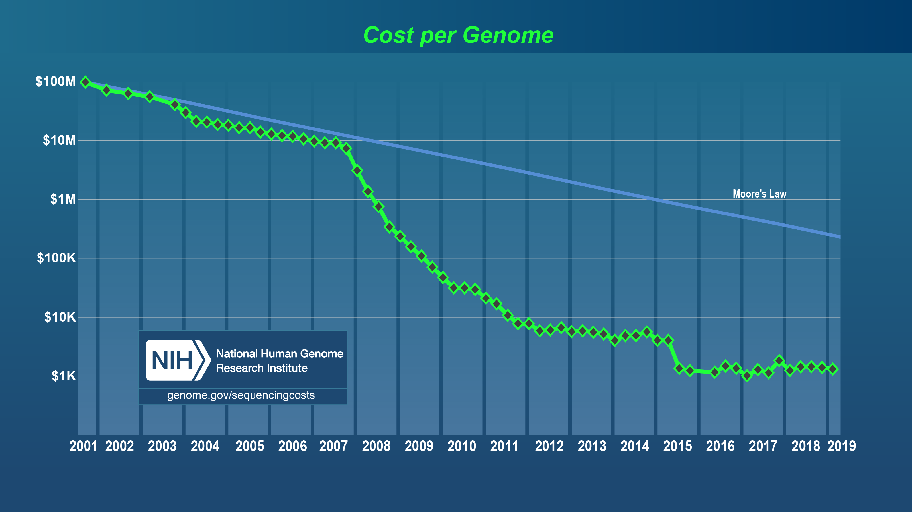
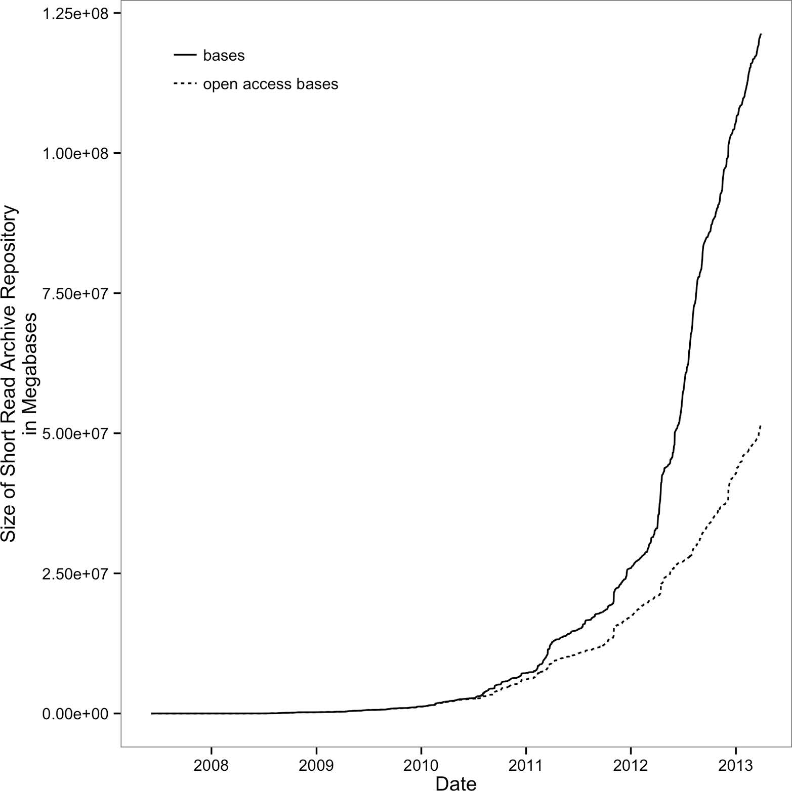

# 第一章 如何学习生物信息学
现在，在世界各地的实验室里，机器正在对地球上生命的基因组进行测序。即使在基因组测序方面成本迅速下降和巨大的技术进步，我们也只是看到了每一个细胞、组织、有机体和生态系统中所包含的生物信息的一瞥。然而，我们正在收集的全部生物信息中的一小部分相当于生物学家需要处理的大量数据。在人类历史上，我们理解生命复杂性的能力从来没有像现在这样依赖于我们处理和分析数据的技能。

这本书是关于通过发展数据技能来学习生物信息学的。在本章中，我们将看到什么是数据技能，以及为什么学习数据技能是学习生物信息学的最佳方式。我们还将看看什么是健壮和可重复的研究需要。

## 为什么是生物信息学？生物学不断增长的数据

生物信息学家关注用专门的技能和工具从大量数据中获得生物理解。在生物学历史的早期，数据集很小且易于管理。大多数生物学家在上了统计学课程后，可以在个人台式电脑上使用Microsoft Excel来分析自己的数据。然而，这一切都在迅速变化。大型测序数据集广泛存在，并且在未来只会变得更加常见。分析这些数据需要不同的工具、新的技能和许多具有大量内存、处理能力和磁盘空间的计算机。

在相对较短的时间内，测序成本大幅下降，使研究人员能够利用测序数据帮助回答重要的生物学问题。早期测序是低吞吐量和昂贵的。全基因组测序工作是昂贵的(人类基因组成本约27亿美元)，只有通过大规模的合作努力才能实现。自人类基因组发布以来，测序成本一直呈指数级下降，直到2008年左右，如图1-1所示。随着下一代测序技术的引入，测序一个巨型DNA的成本下降得更快。在这一关键时刻，一项只有大型协作测序工作(或财力雄厚的个人研究人员)才能负担得起的技术，对所有生物学领域的研究人员来说都是负担得起的。您可能会阅读这本书，以学习如何使用不到10年前成本太高而无法生成的测序数据。


图1-1。测序成本的下降(注意y轴是在对数标度上)；2008年前后的急剧下降是由于引入了下一代测序数据。(图复制并从NIH下载数据)

这些新技术导致测序成本下降的结果是什么？正如你可能已经猜到的，大量的数据。在指数增长之后，生物数据库中的数据已经膨胀。曾经在协作者之间共享的小型数据库已经足够了，但现在全世界的服务器上都有PB级的有用数据。对生物学问题的关键洞察力不仅存储在硬盘上未分析的实验数据中，而且还存储在数千英里之外的数据中心的磁盘上。

生物数据库的增长与测序成本的下降一样令人震惊。例如，考虑sequence read Archive(以前称为Short Read Archive)，它是来自测序实验的原始测序数据的存储库。自2010年以来，它经历了显着的增长，见图1-2。

要将测序数据的这种令人难以置信的增长放入上下文中，请考虑摩尔定律(Moore‘s Law)。Gordon Moore(英特尔的联合创始人)观察到计算机芯片中晶体管的数量大约每两年翻一番。每芯片更多的晶体管转化为计算机处理器的更快速度和计算机中更多的随机存取存储器，这将导致更强大的计算机。这种非凡的技术进步速度--每两年产量翻一番--可能是人类有史以来技术发展最快的一次。然而，自2011年以来，存储在Short Read Archive中的测序数据量甚至超过了这一令人难以置信的增长，每年都翻了一番。

让事情变得更加复杂的是，用于分析生物数据的新工具正在不断地被创造出来，而且它们的底层算法也在不断进步。2012年的综述列出了70多个短读长比对软件。同样，我们的基因组组装方法在过去五年中也发生了很大的变化，因为随着短的高通量测序reads的出现，拼接长序列的方法(如重叠布局算法)被抛弃。现在，测序化学的进步正在导致更长的测序reads长度，新的算法正在取代其他只有几年历史的算法。

不幸的是，这种丰富和快速发展的生物信息学工具有严重的缺点。通常，生物信息学工具没有进行充分的基准测试，或者如果是的话，它们只在一个有机体中进行基准测试。这使得新的生物学家很难找到并选择最好的工具来分析他们的数据。让事情变得更加困难的是，一些生物信息学程序没有积极开发，因此它们失去相关性或携带可能对结果产生负面影响的bug。所有这些使得在你自己的研究中选择一个合适的生物信息学程序变得困难。更重要的是，必须批判性地评估基于您自己的数据运行的生物信息学程序的输出。我们将看到数据技能如何帮助我们在第二部分中评估程序输出的示例。


图1-2. Short Read Archive的指数增长；开放存取基础是向公众提供的SRA提交(图复制和从NIH下载的数据)

## 学习数据技能以学习生物信息学

生物数据的性质变化如此之快，你应该如何学习生物信息学？有了所有的工具，并且不断地被创造出来，一个生物学家怎么才能知道一个程序是否会对她的生物体的数据起到适当的作用呢？

解决方案是像生物信息学家一样接近生物信息学：尝试一些东西，并评估结果。这样，生物信息学就是关于拥有使用计算机对数据进行实验的技能，并理解你的结果。实验部分很容易，这对大多数科学家来说都是自然而然的。对大多数生物学家来说，限制因素是拥有在计算机上自由试验和处理大数据的数据技能。这本书的目标是教你必要的生物信息学数据技能，让你在计算机上实验数据就像你在实验室里进行实验一样容易。

不幸的是，生物学家的许多常用计算工具无法扩展到现代生物数据的大小和复杂性。复杂的数据格式，与众多程序的接口，以及评估软件和数据使大型生物信息学数据集难以处理。学习核心生物信息学数据技能将为您提供学习、应用和评估任何生物信息学程序或分析方法的基础。在10年内，生物信息学家可能只会使用今天的一些生物信息学软件程序。但我们肯定会使用数据技能和实验来评估未来的数据和方法。

那么什么是数据技能呢？它们是一组计算技能，使您能够使用一组众所周知的工具，快速即兴设计一种查看复杂数据集的方法。一个很好的类比就是爵士乐音乐家所说的“排骨”。有好节奏的爵士音乐家可以走进夜总会，听到一首熟悉的标准歌曲正在播放，识别和弦变化，并开始在这些和弦上播放音乐思想。同样，具有良好数据技能的生物信息学家可以接收到巨大的测序数据集，并立即开始使用一组工具来查看数据所讲述的故事。

就像一个掌握了乐器的爵士乐音乐家一样，一个拥有优秀数据“排骨”的生物信息学家掌握了一套工具。学习自己的工具是发展数据技能的必要步骤，但还不够(类似地，学习乐器是演奏音乐想法的必要步骤，但不是充分步骤)。在整本书中，我们将发展我们的数据技能，从建立生物信息学项目和第二部分中的数据，到学习第三部分中用于数据分析的大小工具。然而，这本书只能让你走上正确的道路；真正的精通需要通过反复地将技能应用于实际问题来学习。

## 可重复和稳健研究的新挑战

生物学对大型测序数据集的越来越多的使用正在改变我们所需的工具和技能：它也在改变我们的科学发现的可重复性和健壮性。当我们利用新的工具和技能来分析基因组学数据时，有必要确保我们的方法仍然像任何其他实验方法一样可重复性和健壮性。不幸的是，我们数据的大小和分析工作流程的复杂性使得这些目标在基因组学中特别困难。

重现性的必要条件是我们共享我们的数据和方法。在前基因组学时代，这要容易得多。论文可能包括详细的方法总结和完整的数据集--就像Kreitman 1986年的论文中对4713bp的adh基因侧翼序列所做的那样(它被嵌入在论文的中间)。现在的论文有很长的补充方法，代码和数据。共享数据也不再是无关紧要的，因为测序项目可以包括TB级的伴随数据。分析中使用的参考基因组和注释数据集不断更新，这会使重现性变得棘手。期刊网站上的补充材料、方法和数据的链接中断，教师网站上的材料在教员移动或更新其网站时消失，当开发人员离开而不更新代码时，软件项目变得陈旧。在本书中，我们将看到在进行实际分析的同时，可以做些什么来提高项目的再现性，因为我相信这些都是必要的补充活动。

此外，生物信息学分析的复杂性可能导致发现容易出错和技术混淆。即使是相当常规的基因组学项目也可以使用几十个不同的程序，复杂的输入参数组合，以及许多样本和注释数据集；此外，工作可能分布在服务器和工作站之间。所有这些计算数据处理步骤都产生了用于更高层次分析的结果，在那里我们得出了我们的生物学结论。最终的结果是，研究发现可能停留在一个摇摇欲坠的脚手架上，有许多处理步骤。更糟糕的是，生物信息学工作流和分析通常只运行一次以产生出版物的结果，然后再也不运行或测试。这些分析可能依赖于所使用的所有软件的非常特定的版本，这使得在不同的系统上重现变得困难。在学习生物信息学数据技能时，有必要同时学习再现性和健壮的最佳实践。让我们依次看一下再现性和健壮性。

## 可重复性研究

重复科学发现是确认其准确性的唯一方法，而不是单个实验或分析的人工产物。卡尔·波普尔(Karl Popper)在“科学发现逻辑”(The Logic Of Science Discovery)中有一句名言：“不可重复的单一事件对科学没有意义”(1959年)。实验和分析的独立复制是我们评估科学发现有效性的金标准。不幸的是，大多数测序实验都太昂贵，无法从试管中复制出来，所以我们越来越多地依赖于电子可重复性。生物信息学项目的复杂性通常会阻碍复制，所以作为优秀的科学家，我们的工作是通过简化来促进和鼓励电子技术的再现性。正如我们稍后将看到的，采用良好的可重复性实践也可以使您作为研究人员的生活变得更容易。

那么什么是可重复的生物信息学项目呢？至少，它共享了项目的代码和数据。大多数期刊和资助机构都要求您共享项目的数据，而NCBI的序列读取档案等资源就是为此目的而存在的。现在，编辑和审阅者通常会建议(或在某些情况下要求)也共享项目的代码，特别是如果代码是研究结果的重要部分。然而，我们可以并且应该做更多的事情来确保我们的项目的再现性。通过复制生物信息学分析来验证结果，我从这些侦察练习中了解到细节决定成败。

例如，我和同事曾经很难复制我们自己做的RNA-seq差异表达分析。我们在几周前对样本的一个子集进行了分析，得到了初步结果，但令我们惊讶的是，我们目前的分析产生的差异表达基因的集合要小得多。在重新检查了我们过去的结果是如何创建的，比较了数据版本和文件创建时间，并查看了分析代码中的差异之后，我们仍然被难住了--没有什么可以解释结果之间的差异。最后，我们检查了R包的版本，并意识到它已经在我们的服务器上更新了。然后我们重新安装了旧版本，以确认这是差异的来源，而且确实是。这里的教训是，无论是您将来还是其他人进行的复制，不仅依赖于数据和代码，还依赖于诸如软件版本、数据下载时间以及数据版本等细节。此元数据或有关数据的数据是确保可再现性的关键细节。

生物信息学重复性的另一个激动人心的案例研究是所谓的“Duke Saga”。杜克大学的Anil Potti博士和其他研究人员创造了一种方法，该方法使用高通量微阵列的表达数据来检测和预测对不同化疗药物的反应。这些方法是个性化医学新水平的开始，并被用于临床试验中确定患者的化疗治疗。然而，两位生物统计学家，Keith Baggerly和Kevin Coombes，在试图重现这项研究时，在分析中发现了严重的缺陷(Baggerly和Coombes，2009)。其中许多都需要Baggerly和Coombes所称的“法医生物信息学”--当没有足够的文件追溯每一步时，试图重现一项研究的发现。总的来说，Baggerly和Coombes发现了多个严重错误，包括：

- 一个差一错误，因为基因表达值的整个列表相对于其正确的标识符下移
- 所使用的微阵列上没有两个具有生物学意义的离群点基因
- 处理与运行微阵列的日期混淆
- 样本组名称混淆

Baggerly和Coombes的工作最好地总结在他们的开放访问文章“从细胞系导出化学敏感性：高通量生物学中的法医生物信息学和可重复研究”(请参阅本章的GitHub目录以获取有关Duke Saga的更多信息)。Baggerly和Coombes的工作给我们的教训是“常见的错误是简单的，简单的错误是常见的”，糟糕的文档可能导致错误和不可再现性。方法、数据版本和代码的文档不仅有助于重现性，而且很可能在他们的研究中防止了这些严重错误中的少数几个。在你的项目中争取最大的可重复性也会使你的工作更健壮。

## 稳健研究与生物信息学的黄金法则

在湿实验室生物学中，当实验失败时，它可以非常明显，但在计算中并不总是这样。看起来像罗夏印迹而不是整齐条带的电泳凝胶清楚地表明出了问题。在科学计算中，错误可以是无声的；也就是说，代码和程序可能会产生输出(而不是因错误而停止)，但这种输出可能是不正确的。当你学习生物信息学时，这是一个非常重要的概念。

此外，在科学计算中，代码只运行一次是很常见的，因为研究人员可以得到他们想要的输出并继续下一步。相反，考虑一下视频游戏：它在数千(如果不是数百万)不同的机器上运行，并且实际上是由许多用户不断测试的。如果出现了删除用户分数的bug，用户很可能会很快注意到并报告它。不幸的是，对于大多数生物信息学项目来说，情况并非如此。

基因组学数据也为强健的研究创造了自己的挑战。首先，大多数生物信息学分析产生的中间输出太大，维度太高，无法检查或容易可视化。大多数分析还涉及多个步骤，因此即使检查整个中间数据集是否存在问题是可行的，但对于每个步骤都很难做到这一点(因此，我们通常采取检查数据样本或查看数据汇总统计数据的方法)。其次，在湿实验室生物学中，通常更容易形成对实验结果的预先预期。例如，研究人员可能期望看到某种mRNA在某些组织中以低于特定管家基因的丰度表达。有了这些先前的期望，异常结果可以归因于失败的分析而不是生物学。相反，大多数基因组学结果的高维度使得几乎不可能形成强烈的预先预期。通过RNA-seq实验对成千上万个基因的表达形成特定的预先预期是不切实际的。不幸的是，没有事先的预期，很难区分好的结果和坏的结果。

生物信息学家还必须警惕，生物信息学程序，甚至是经过社区审查的大型工具，如校准器和汇编器，可能在他们特定的生物体上不能很好地工作。生物体都是奇妙的，奇怪的不同，它们的基因组也是。许多生物信息学工具都是在少数模型二倍体生物(如人类)上测试的，而在生命树的其他部分的复杂基因组上测试得不太好。我们真的期望根据人类数据调谐的短读定位器的开箱即用参数能在四倍于其大小的多倍体基因组上起作用吗？大概不会吧。

确保一切正常工作的简单方法是采取谨慎的态度，并检查计算步骤之间的一切。此外，你应该以一种健康的怀疑态度对待生物数据(无论是来自实验还是来自数据库)，认为它可能有问题。在计算社区中，这与“垃圾输入，垃圾输出”的概念有关--分析的效果取决于输入的数据。在教学生物信息学时，我经常把这个想法作为生物信息学的金科玉律：
Never ever trust your tools (or data)

这并不是要让你偏执地认为没有任何生物信息学是可信的，或者你必须测试你的数据上的每一个可用的程序和参数。相反，这是为了训练你采取软件工程师和生物信息学家所学到的同样谨慎的态度。简单地检查输入数据和中间结果，运行快速健全检查，维护适当的控制和测试程序是一个很好的开始。这也避免了您以后遇到bug，因为修复它们意味着要重新做大量的工作。您自然会测试实验室技术是否工作并给出一致的结果；采用生物信息学的健壮方法只是在生物信息学分析中做同样的工作。

## 采用稳健和可重复的实践也会让你的生活更轻松

在科学领域的工作让我们中的许多人以艰难的方式学到了一些生活的事实。这些就像墨菲定律：任何可能出错的事情都会出错。生物信息学有自己的一套规律，就像这样。在实地工作并与其他生物信息学家讨论战争故事后，我几乎可以保证会发生以下情况：

- 几乎可以肯定，您必须多次重新运行分析，可能会使用新的或更改的数据。经常发生这种情况是因为你会发现一个bug，合作者会添加或更新一个文件，或者你会想要在步骤的上游尝试一些新的东西。在所有情况下，下游分析都依赖于这些早期结果，这意味着需要重新运行分析的所有步骤。

- 在未来，您(或您的合作者或顾问)几乎肯定需要重新访问项目的一部分，它将看起来完全神秘。你唯一的辩护就是记录每一步。如果不写下关键事实(例如，您从哪里下载数据，何时下载，以及运行了哪些步骤)，您肯定会忘记它们。记录你的计算工作相当于保存一个详细的实验笔记本--这是科学中绝对重要的一部分。

幸运的是，采用将使您的项目可重复性的实践也有助于解决这些问题。从这个意义上说，生物信息学(以及一般的科学计算)中的良好实践既使生活变得更容易，也导致了可重复的项目。原因很简单：如果项目的每个步骤都被设计为重新运行(可能使用不同的数据)，并且有很好的文档记录，那么它已经很好地处于可重复性的道路上了。

例如，如果我们使用脚本自动执行任务，并跟踪所有输入数据和软件版本，则可以通过击键重新运行分析。复制此脚本中的所有步骤要容易得多，因为编写良好的脚本自然会记录工作流(我们将在第12章中详细讨论)。这种方法还可以节省您的时间：如果您接收到新的或更新的数据，您所需要做的就是用新的输入文件重新运行脚本。这在实践中并不难做到；编写脚本并不困难，计算机擅长做脚本中列举的重复性任务。

## 稳健研究建议

健壮的研究在很大程度上是关于采用一组实践，这些实践积累了对您有利的可能性，即沉默的错误不会混淆您的结果。如上所述，除了防止可怕的无声错误之外，大多数这些实践也是有益的--这就是在日常生物信息学工作中应用以下建议的更多理由。

### 重视实验设计

稳健的研究始于良好的实验设计。不幸的是，再多精彩的分析也救不了一个设计糟糕的实验。引用一位杰出的统计学家和遗传学家的话：
在实验结束后咨询统计学家，往往只是要求他进行尸检。他也许可以说出这个实验的死因。
<p align="right">—R.A. Fisher</p>

这句话切中了我的心；我见过项目落在我的桌子上准备好进行分析，在花费了数千美元的测序之后，但它们在到达时就完全死了。好的实验设计不一定是困难的，但因为它从根本上是一个统计主题，它超出了本书的范围。我之所以提到这个话题，是因为不幸的是，这本书中的任何其他内容都无法挽救设计糟糕的实验。特别有必要考虑高通量研究中的实验设计，因为技术上的“批量效应”可能会使研究显着混乱(关于这一点的观点，请参见Leek等人，2010)。

大多数统计学入门课程和书籍都涵盖了实验设计中的基本主题。Quinn和Keough的“生物学家的实验设计和数据分析”(剑桥大学出版社，2002)是一本关于这一主题的优秀书籍。莎拉·博斯劳尔的“O‘Reilly’s Statistics in Nutshell，第2版”的第18章也很好地涵盖了基础知识。不过请注意，基因组学实验中的实验设计是另一回事，并且正在积极研究和改进。确保你的几千美元的实验达到它的潜力的最好方法是看看你的特定项目目前的最佳设计实践是什么。这也是一个好主意，咨询您当地友好的统计学家，了解任何实验设计问题或您在计划实验时可能存在的问题。

### 为人类编写代码，为计算机编写数据

调试的难度是最初编写代码的两倍。因此，如果您尽可能巧妙地编写代码，根据定义，您还不够聪明，无法对其进行调试。<p align="right">—Brian Kernighan </p>

生物信息学项目可能涉及堆积如山的代码，而我们针对bug的最好防御之一就是为人类而不是为计算机编写代码(这一点在Wilson等人的优秀文章中提出，2012)。人类是进行调试的人，因此编写简单、清晰的代码可以使调试变得更容易。

代码应该是可读的，分解为小的包含组件(模块化)，并且可重用(因此您不需要重写代码来一遍又一遍地执行相同的任务)。这些实践在软件世界中是至关重要的，也应该应用于您的生物信息学工作中。注释代码和采用样式指南是提高代码可读性的简单方法。Google有许多语言的公共风格指南，这些都是很好的模板。为什么代码的可读性如此重要？首先，可读代码使项目更具可重复性，因为其他人可以更容易地理解脚本做什么以及它们是如何工作的。其次，在可读的、注释良好的代码中查找和更正软件错误要比混乱的代码容易得多。第三，当代码注释良好且编写清晰时，将来重新访问代码总是更容易。编写模块化和可重用代码只是需要实践--我们将在整本书中看到一些这样的例子。

与代码相反，数据的格式应该以便于计算机可读性的方式进行。很多时候，我们人类记录数据的方式最大限度地提高了数据对我们的可读性，但在计算机处理数据之前需要进行大量的清理和整理。计算机可读的数据(和元数据)越多，我们就越能利用计算机来处理这些数据。

### 让你的电脑替你做这项工作

人们做死记硬背的活动往往会犯很多错误。让你的工作更健壮的最简单的方法之一就是让你的电脑尽可能多地做这种死记硬背的工作。这种自动化任务的方法更健壮，因为它降低了犯小错误(如意外遗漏文件或错误命名输出)的可能性。

例如，通过单独键入(或复制和粘贴)每个命令来在20个不同的文件上运行程序是脆弱的--每处理一个文件，发生粗心错误的可能性都会增加。在生物信息学工作中，养成让计算机为你做这种重复性工作的习惯是很好的。与其粘贴相同的命令20次，只需更改输入和输出文件，不如编写一个脚本来完成这项工作。这不仅更容易并且不太可能导致错误，而且还增加了可重复性，因为您的脚本记录下了对每个文件所做的事情。

利用自动化任务的好处需要在组织项目、数据和代码时进行一些思考。简单的习惯，如以计算机(而不仅仅是人类)可以理解的一致方式命名数据文件，可以极大地促进自动化任务，并使工作变得更加容易。我们将在第2章中看到这方面的例子。

### 在代码和方法中进行断言并发出声音

当我们写代码时，我们倾向于对我们的数据有隐含的假设。例如，我们期望只有三个DNA链选项(正向，反向和未知)，基因的起始位置小于结束位置，并且我们不能有负位置。我们对数据所做的这些隐含的假设会影响我们编写代码的方式；例如，如果我们假设某种情况不会发生，我们可能不会考虑在代码中处理它。不幸的是，这可能导致可怕的静默错误：我们的代码或程序接收到超出我们预期值的值，行为不当，但仍然在没有警告的情况下返回输出。防止此类错误的最佳方法是使用断言语句(如Python的assert()和R的stopifnot())显式声明和测试我们关于代码中数据的假设。

几乎每种编程语言都有自己的Assert函数版本。这些Assert函数的操作方式类似：如果语句的计算结果为false，则Assert函数将停止程序并引发错误。它们可能很简单，但这些断言函数在稳健研究中是必不可少的。在我职业生涯的早期，一位导师激励我养成了非常宽松地使用断言的习惯--即使看起来似乎绝对不可能虚假--但我一直惊讶于这些断言有多少次捕捉到了一个微妙的错误。在生物信息学(以及所有领域)中，至关重要的是我们尽可能地将可怕的无声错误转变为响亮的错误。

### 测试代码，或者让代码测试代码

软件工程师是一群聪明的人，他们把让自己的计算机做工作的想法提升到一个新的水平。他们这样做的一种方法是让代码测试其他代码，而不是手工完成。测试代码的一种常见方法称为单元测试。在单元测试中，我们将代码分解为单独的模块化单元(这也具有提高可读性的副作用)，并编写测试此代码的附加代码。在实践中，这意味着如果我们有一个名为add()的函数，我们就会编写一个名为test_add()的附加函数(通常在单独的文件中)。这个test_add()函数将调用具有特定输入的add()函数，并测试输出是否如预期的那样。在Python中，这可能类似于：
```
EPS = 0.00001 # 比较浮点值时使用的较小数字
def add(x, y):
"""Add two things together."""
return x + y
def test_add():
"""测试add()函数是否适用于各种数值类型。"""
assert(add(2, 3) == 5)
assert(add(-2, 3) == 1)
assert(add(-1, -1) == -2)
assert(abs(add(2.4, 0.1) - 2.5) < EPS)
```

test_add()函数的最后一行看起来比其他行更复杂，因为它比较的是浮点值。很难在计算机上比较浮点值，因为存在表示和舍入误差。然而，这是一个很好的提醒，我们总是受到我们的机器所能做的事情的限制，我们必须在分析中记住这些限制。

与软件行业相比，单元测试在科研编码中的使用要少得多，尽管科研代码更有可能包含错误(因为我们的代码通常只运行一次以生成出版物的结果，并且科研代码中的许多错误都是沉默的)。我将此称为科研编码的悖论：科研编码容易出错的本质意味着我们应该使用与软件行业一样多或更多的测试，但实际上我们做的测试(如果有的话)要少得多。这是令人遗憾的，因为现在许多科学结论都是堆积如山的代码的结果。

虽然测试代码是发现、修复和防止软件错误的最好方法，但测试并不便宜。测试代码使我们的结果变得健壮，但它也占用了我们相当多的时间。不幸的是，对于研究人员来说，为他们编写的每一段代码编写单元测试需要花费太多的时间。科学发展迅速，在编写和执行单元测试所需的时间内，您的研究可能会过时或被抢走。更明智的策略是在每次编写代码时考虑三个重要变量：

- 此代码被其他代码调用了多少次？
- 如果此代码错误，对最终结果会有多大危害？
- 如果发生错误，错误会有多明显？

测试一段代码的重要性与前两个变量成正比，与第三个变量成反比(即，如果bug非常明显，就没有理由为它编写测试)。我们将在整本书的例子中采用这种策略。

### 尽可能使用现有的库

在每个初露头角的程序员的职业生涯中都有一个转折点，当他们觉得编写代码足够舒服时，他们会想，“嘿，我为什么要用一个库来做这个，我自己可以很容易地写这个。”这是一种令人振奋的感觉，但有很好的理由使用现有的软件库。

与您自己编写的库相比，现有的开源库有两个优势：历史更长，受众更广泛。这两个优点都转化为更少的bug。软件中的bug类似于大海捞针的问题。如果您编写自己的软件库(其中肯定隐藏着一些bug)，那么您就是一个人在寻找几根针。相比之下，开源软件库在本质上有更多的人在寻找更长时间的针头。因此，与您自己的自制版本相比，在这些开放源码库中更有可能发现、报告和修复bug。

这方面的一个很好的例子是在编写脚本将核苷酸翻译为蛋白质时出现的一个潜在的微妙问题。大多数有一些编程经验的生物学家都可以很容易地编写脚本来完成这项任务。但是在这些简单的编程练习的背后隐藏着你自己可能没有考虑到的隐藏的复杂性。如果你的核苷酸序列中含有Ns怎么办？或者Ys？又或者Ws？Ns，Ys和Ws可能看起来不像是有效的碱基，但它们是国际纯粹和应用化学联合会(IUPAC)标准的模糊核苷酸，在生物信息学中完全有效。在许多情况下，经过充分审查的软件库已经发现并修复了这些隐藏的问题。

### 将数据处理为只读

许多科学家花费大量时间使用Excel，而不眨眼就会改变单元格中的值并保存结果。我强烈反对以这种方式修改数据。相反，更好的方法是将所有数据视为只读，并且只允许程序读取数据并创建新的、单独的结果文件。

为什么在生物信息学中将数据作为只读处理很重要？首先，就地修改数据很容易遇到崩溃的结果。例如，假设您编写了一个直接修改文件的脚本。在处理大型文件的过程中，脚本遇到错误并崩溃。因为您已经修改了原始文件，所以无法撤消更改并重试(除非您有备份)！本质上，此文件已损坏，无法再使用。

其次，当我们就地修改文件时，很容易忘记我们是如何更改它的。与每个步骤都有一个输入文件和一个输出文件的工作流不同，就地修改的文件不会给出我们对它所做的任何指示。如果我们忘记了我们是如何更改文件的，并且没有原始数据的备份副本，那么我们的更改基本上是不可复制的。

对于熟悉在Excel中广泛工作的科学家来说，将数据视为只读似乎有违直觉，但这对于强大的研究是必不可少的(并可防止灾难，并有助于重复性)。最初的困难是值得的；除了保护数据不受损坏和不正确的更改之外，它还促进了可重复性。此外，分析的任何步骤都可以很容易地重做，因为程序不会改变输入数据。

### 花时间将常用脚本开发为工具

在您作为一名高技能生物信息学家的整个开发过程中，您最终将创建一些反复使用的脚本。这些可能是从数据库下载数据的脚本，或者处理某种类型的文件，或者可能只是生成相同的漂亮图形。这些脚本可以与实验室成员共享，甚至可以跨实验室共享。您应该付出额外的努力和关注，使这些高使用率或高度共享的脚本尽可能健壮。在实践中，我认为这个过程是将一次性脚本变成工具。

与脚本不同的是，工具被设计为可以一遍又一遍地运行。它们有良好的文档记录，具有显式的版本控制，具有可理解的命令行参数，并保存在共享的版本控制存储库中。这些看起来可能是细微的差异，但强有力的研究是关于做一些小事情，让你喜欢的事情堆叠起来，以防止错误。根据定义，重复应用于大量数据集的脚本会影响更多结果，因此应该进行更多开发，以使它们更加健壮和用户友好。与其他研究人员共享的脚本尤其如此，这些研究人员需要能够查阅文档并将您的工具安全地应用于他们自己的数据。虽然开发工具比编写一次性脚本更费力，但从长远来看，它可以节省时间并防止头痛。

### 让数据证明它的高质量

当科学家考虑分析数据时，他们通常会考虑分析实验数据以得出生物学结论。然而，为了进行稳健的生物信息学工作，我们实际上需要分析的不仅仅是实验数据。这包括检查和分析关于实验数据质量的数据，来自生物信息学程序的中间输出文件，以及可能的模拟测试数据。这样做可以确保我们的数据处理功能如我们预期的那样运行，并体现了生物信息学的黄金法则：不要相信你的工具或数据。

永远不要假设数据集是高质量的，这一点很重要。相反，数据的质量应该通过探索性数据分析(称为EDA)来证明。EDA既不复杂也不耗时，并且将使您的研究对大型数据集中潜伏的惊喜更加健壮。我们将在第8章学习更多关于使用R的EDA。

## 对可重复性研究的建议

采用可重复的研究实践并不需要太多额外的努力。就像健壮的研究实践一样，可重复的方法最终会让你的生活变得更容易，因为你自己可能需要在忘记细节很久之后复制你过去的工作。下面是一些基本的建议，当你练习生物信息学，以使你的工作可重现时要考虑的一些基本建议。

### 发布您的代码和数据

对于可重复性，绝对最低要求是发布代码和数据。没有可用的代码和数据，您的研究是不可重复的(参见Peng，2001对此进行了很好的讨论)。我们将在本书稍后讨论如何共享代码和数据。

### 记录所有内容

科学家走进实验室的第一天，他们被告知要保留一个实验笔记本。可悲的是，这种良好的做法经常被计算领域的研究人员抛弃。发布代码和数据是可再现性的最低要求，但广泛的文档也是可再现性的重要组成部分。为了完全重现一项研究，分析的每一步都必须比学术文章所能完成的更详细地描述。因此，额外的文档对于可重复性是必不可少的。

采用的一个好实践是将每个分析步骤记录在纯文本 README 文件中。像详细的实验笔记本一样，此文档作为您步骤的宝贵记录，文件在哪里，它们来自哪里，或它们包含什么。此文档可以与项目的代码和数据一起存储(我们将在第2章和第5章中看到更多相关信息)，这可以帮助合作者了解您所做的工作。文档还应包括执行的每个程序的所有输入参数、这些程序的版本以及它们是如何运行的。现代软件，如R的Nickr和IPython笔记本是记录研究的强大工具；我在GitHub上的本章 README 文件中列出了一些开始使用这些工具的资源。

### 将数字和统计作为脚本的结果

确保科学项目的可重复性不仅仅涉及对研究结果重要的关键统计测试的可重复性--支持论文的元素(例如，图和表)也应该是可重现的。确保这些组件可重复性的最好方法是让每个图像或表都是一个(或多个)脚本的输出。

编写脚本以生成图像和表格似乎比在Excel或R中交互生成这些更耗时。但是，如果您曾经在更改之前的步骤后不得不手动重新生成多个图形，您就知道这种方法的优点。生成表和图像的脚本可以很容易地重新运行，节省您的时间，并使您的研究更具可重复性。像IPython记事本和Nidr(在上一节中提到)这样的工具也在很大程度上帮助完成这些任务。

### 使用代码作为文档

对于复杂的处理流程，最好的文档通常是文档化良好的代码。因为代码足以告诉计算机如何执行程序(以及使用哪些参数)，所以它也几乎足以告诉人们如何复制您的工作(如软件版本和输入数据等附加信息也是完全可复制的)。在许多情况下，编写脚本来执行分析的关键步骤要比输入命令然后在其他地方记录它们更容易。同样，代码是一件奇妙的事情，使用代码来记录分析的每个步骤意味着如果必要的话，可以很容易地重新运行分析的所有步骤--脚本只需重新运行即可。

## 不断提高您的生物信息学数据技能

当你读完这本书的其余部分时，把本章介绍的基本思想放在脑后。我在这里介绍的内容足以让您开始思考健壮和可重复的生物信息学中的一些核心概念。这些主题中的许多(例如，再现性和软件测试)目前仍在积极研究中，我鼓励感兴趣的读者更深入地探索这些主题(我已经在本章关于GitHub的自述文件中包含了一些资源)。


